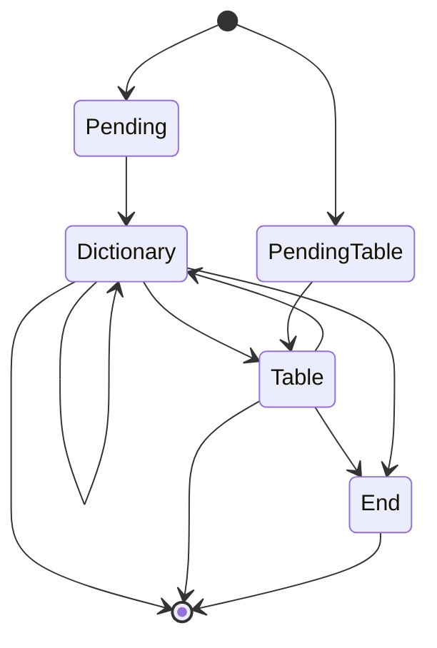

# Text Report Reading Service

<b>Text Report Reading Service</b> is tools that processing the .txt report and retrieve the data from dictionary entries and table.

## Structure of Text Report

Text report is a .txt file formatted as a report. It includes multiple pages. Each pages may consist of a dictionary section and a table section.
The example of the text report is in below:

```
~REPORT ID - S01           DATE - 01/01/2022
                           PAGE - 1         
                                            
 ACTIVITY : RELEXING HIKING                 
 EVENT DT : 11/02/2022                      
                                            
 NAME                  AGE          MEMBER? 
 ------------------------------------------ 
 Anna Ackwood          23           Y       
 Ben  Brace            25           N       
 Carson Celling        30           N       
~REPORT ID - S01           DATE - 01/01/2022
                           PAGE - 2         
                                            
 ACTIVITY : FISHING                         
 EVENT DT : 20/01/2022                      
                                            
 NAME                  AGE          MEMBER? 
 ------------------------------------------ 
 Sam Smith             50           N       
 Terry Troat           22           Y       
                *END OF REPORT*             

```


### Trigger Keywords

"~" is the starting trigger word that mark the range of a page.
"\*END OF REPORT\*" is the ending trigger word that mark the end of the report.

### Dictionary Section

The section includes a set of data entries. Each data entries consists of key and value.
For example, the dictionary section of the first page includes the dataset,<code>{"REPORT ID":"S01", "DATE":"01/01/2022", "PAGE":1, "ACTIVITY":"RELEXING HIKING"}</code> 

### Table Section
The section includes a list of records.
For example, the table section in the second page includes the list that
<code>
[{"NAME":"Sam Smith", "AGE":50,"MEMBER?": false},{"NAME":"Terry Troat", "AGE":22, "MEMBER?": true}]
</code>
## Structure of Raw Table Text
Also, the service is available for loading the file of raw table text that:
```
012460001111199902010
022460001112199903140
032460001113200309110
042460001114200409210
052460001115200604101
061330001121200606301
072460001122200910110
```
In this case, the substring in [0,2) represents <code>RID</code>, the substring in [2,12) represents <code>ACCOUNT_NO</code>, the substring in [12,20) represents <code>STARTING_DATE</code> and finally the substring in [20,21) represents <code>IS_DELETED</code>.

## Processing Logic

The program follows the state diagram in below:


## Usage
First, create an Object of <code>TxtReportConfig</code> for setting keywords of triggering the content of text report.
```java
TxtReportConfig config = TxtReportConfig.getConfig()
        .setStart("~")
        .setEnd("** END OF REPORT ** ")
        .setReportType(TxtReportType.REGULAR);
```
The report type parameter is <code>TxtReportType.TABLE_TEXT</code> if it is raw table text

Second, create the class of the dictionary model, and the table model.
```java
@TxtReportDictionary
class theDict{
    //add the annotation @XmlElement if exporting .xml files
    @Pair(key ="PAGE - ",valueLength = 3, valuePattern = ".*")
    @NumericValue(precision = 3, scale = 0)
    Integer page;

    @Pair(key = "DATE - ",valueLength = 8, valuePattern = ".*")
    @DateValue(format = "DD/MM/YYYY")
    Date date;

    @Pair(key = "REPORT ID - ",valueLength = 3, valuePattern = "[a-zA-Z0-9]{3}")
    String reportId;
    //Other fields...
    //getter and setter...
}

@TxtReportTable
class theTable{
    //add the annotation @XmlElement if exporting .xml files
    @Column(id=1, start=1, end=23)
    String name;
    
    @Column(id=2, start=23, end=36)
    @NumericValue(precision = 3, scale = 0)
    Integer age;
    
    @Column(id=3, start=36, end=37)
    @BooleanValue(keywordOfTrue = 'Y', keywordOfFalse = 'N')
    Boolean isMember;
    //getter and setter...
}
```
Third, create an Object of <code>TxtReportService</code> for processing the file.
```java
TxtReportService service = new TxtReportService(
  theDict.class,                                // class of the model of the dictionary
  theTable.class,                               // class of the model of the table
  "/to/the/filepath",                           // filepath of the .txt file
  config);                                      // TxtReportConfig object
```
In addition, if text report does not involve table section, <code>DefaultTable.class</code> can be put in the table class parameter. It can be applied in dictionary section which is <code>DefaultDictionary.class</code>

In the last stage, exporting methods can be chosen depends on the need.

```java
TxtReport report = service.retrieveTxtReport();
```
